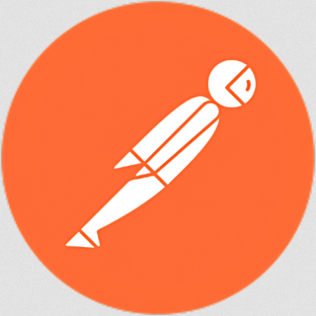
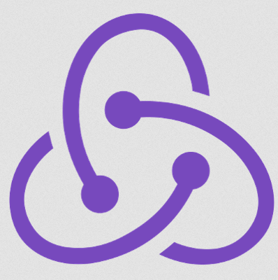
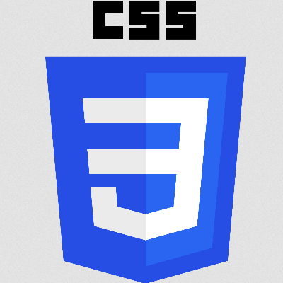
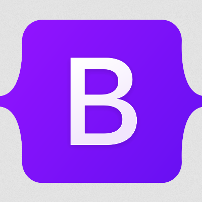
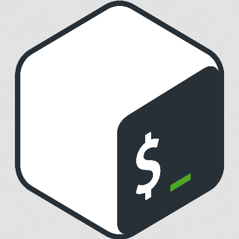

<h2>Hi there</h2>

My name is <strong>Jacek</strong>. I'm a <strong>Full Stack Web Developer</strong> based in Berlin. 
 
I'm driven by curiosity, adaptability, and a collaborative mindset. With a background in Social Science, Market Research, Customer Acquisition, and Project Management, I bring a diverse skill set and a wide-ranging perspective to software development, enabling me to tackle challenges creatively and work effectively within teams.

<h3>You can find me on:</h3>

 

<h3>Technologies &amp; Tools:</h3>
<!-- Operating Systems: Windows, Linux -->

    
    

<!-- Programming Languages: -->

    
    

<!-- Backend Technologies:  -->

    
    
    
    
    

<!-- Databases: MongoDB, PostgreSQL -->

    
    

<!-- Testing Frameworks: Jest -->

    

<!-- Frontend Technologies: -->

    
    
    
    
    
    
    
    

<!-- DevOps Tools: -->

    
    
    
    
    
    
    

<!-- Documentation Tools: Swagger, Draw.io -->

    
    

