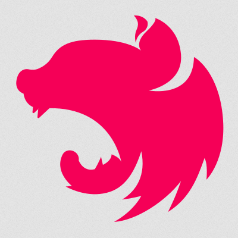
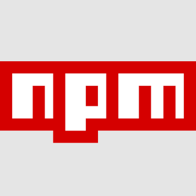
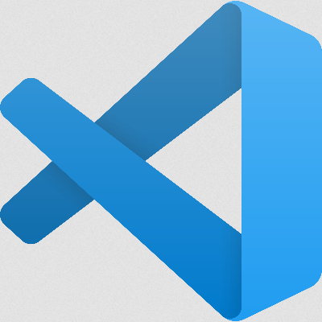

<h2>Hi there</h2>

My name is <strong>Jacek</strong>. I'm a <strong>Full Stack Web Developer</strong> based in Berlin. 
 
I'm  driven by curiosity, adaptability, and a collaborative mindset.
With a background in Social Science, Market Research, Customer Acquisition, and Project Management I bring a diverse skill set and a wide-ranging perspective to software development.

<h3>You can find me on:</h3>

 

<h3>Technologies &amp; Tools:</h3>

<picture></picture>
<picture></picture>
 
<picture></picture>
<picture></picture>
<picture></picture>
<picture></picture>
<picture></picture>
 
<picture></picture>
<picture></picture>
 

<picture>
<picture></picture>
<picture></picture>
<picture></picture>
<picture></picture>
<picture></picture>
<picture></picture>
<picture></picture>
 
<picture></picture>
<picture></picture>
<picture></picture>
<picture></picture>
<picture></picture>
<picture></picture>
<picture></picture>
<picture></picture>
<picture></picture>
<picture></picture>
<picture></picture>
 
<picture></picture>
<picture></picture>
<picture></picture>
<picture></picture>
